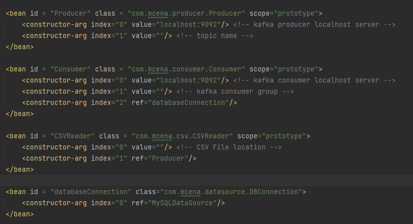
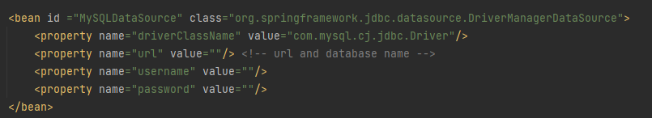

# CSV Kafka
Simple backend application wherein it reads CSV file sends to a kafka broker then consumes the message before it saves into a database.
  - Apache Commons CSV implementation for reading of CSV file.
  - Java Object will be serialized into a JSON using ObjectMapper.
  - Generated JSON will be sent into a Kafka topic (Producer implementation).
  - Kafka Consumer implemented for JSON messages and converts it back into a Java Object.
  - Saves into the database (MySQL configuration).

# Beans.xml

# Database.xml

